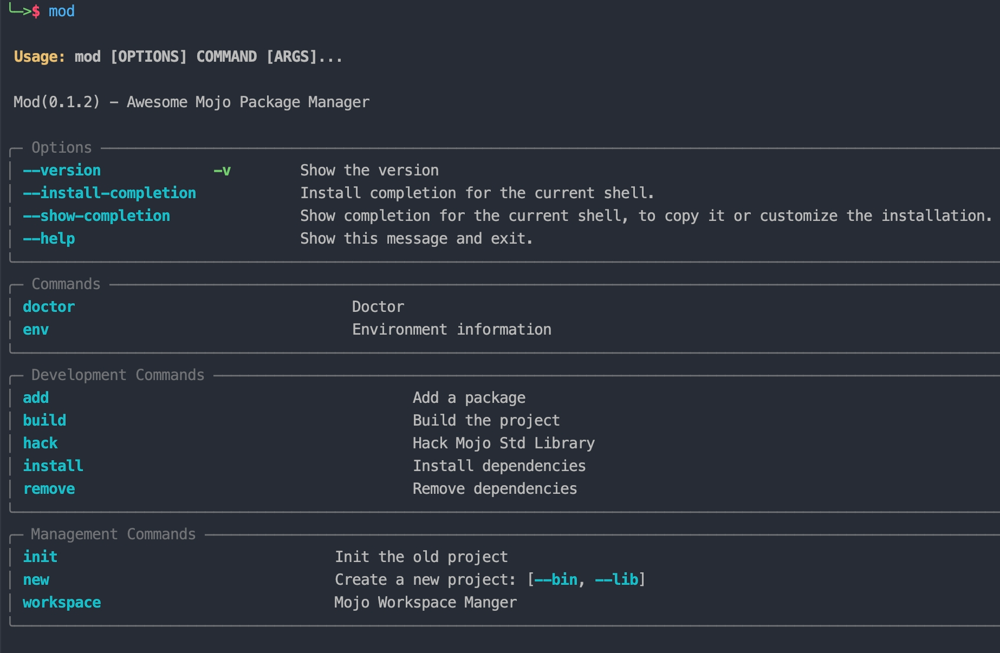
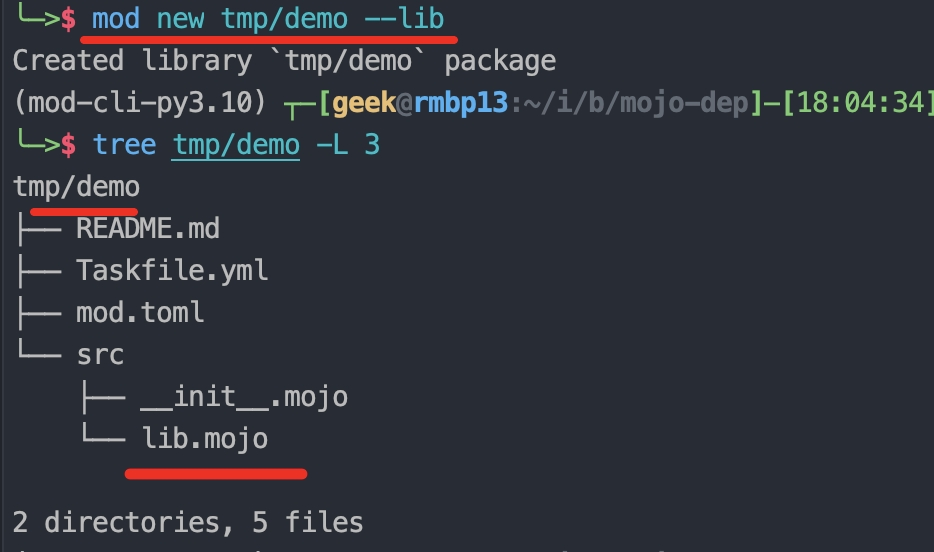

# Mod(Mojo Dep)

[English](./packages/mod-cli/README.md) | [简体中文](./packages/mod-cli/README_CN.md)

## Intro

- `Mod` = `Mojo Dep`.
- `Mod` is [Mojo](https://docs.modular.com/mojo/) `Package Manager Tool`.
- like:
    - Rust: `Cargo`
    - Python: `Pip/Poetry/PDM`
    - Go: `Dep + Vendor`

## Quick Start

- [mod-cli - pypi](https://pypi.org/project/mod-cli/)
- install:

```ruby

# all Platform
pip install mod-cli

# help
mod --help


```



### Manual

- [Mod Docs](./packages/mod-cli/README.md)

```ruby

mod new your/path/to/project --lib

mod new your/path/to/project --bin

...
```




